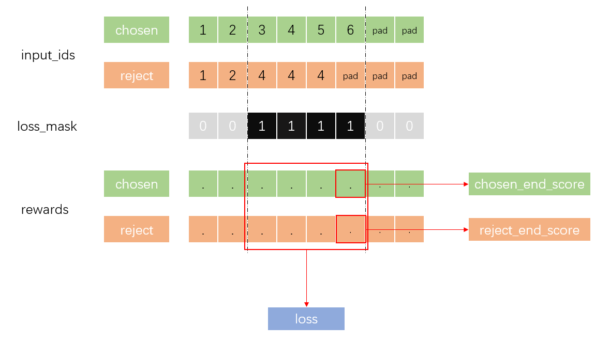
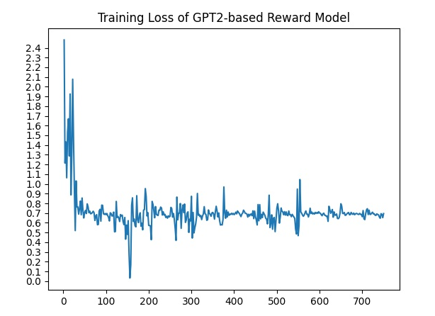

# Reward Model 使用教程

## 概述

Reward Model是一个对大语言模型生成的句子进行判断和打分，用于评估生成式语言模型结果好坏的模型。本教程以GPT2为例，介绍如何训练和评估reward model。

## 数据集准备

### 制作Reward Model训练数据集
以[openai_summarize_comparisons](https://huggingface.co/datasets/CarperAI/openai_summarize_comparisons)数据集为例，示例如下。  
|prompt (string)|chosen (string)|rejected (string)|  
|:------:|:------:|:------:|  
|"SUBREDDIT: r/relationships TITLE: My [21/M] girlfriend [19/F] broke up with me after she went through my Facebook without my permission...the messages in the first place."|"TL;DR: My Girlfriend of 15 months went through my Facebook messages without my permission and found old conversations of me flirting with a girl. She broke up with me and went no contact.|"TL;DR: My girlfriend and I broke up after she went through my Facebook account without my permission.|  
本代码仓提供了openai_summarize_comparisons数据集的处理脚本，执行命令为：
```shell
python comparison_dataset.py
```
脚本中数据集的处理逻辑分为以下几步： 

- 第一步，将数据集重新组织为每条数据样本由一个文本对组成，由接受的回答和拒绝的回答分别与提示词prompt拼接而成的形式。
    ```python
    pair["chosen"] = prompt + "\n" + chosen_summary
    pair["rejected"] = prompt + "\n" + rejected_summary
    ```

- 第二步，使用tokenizer对每条数据中的文本对分别进行编码，获得input_id和attention_mask。
注意：tokenize时需要指定tokenize结果的长度，超过指定长度的进行截断，不足指定长度的进行右填充。
对于openai_summarize_comparisons数据集的处理，指定长度为`max_length=1024`，填充值`PAD_ID=50256`。实际制作时请根据词表等进行设置。
    ```python
    chosen_encodings_dict = tokenizer(
        "<|startoftext|>" + chosen + "<|endoftext|>",
        truncation=True,
        max_length=seq_length,
        padding="max_length",
    )

    rejected_encodings_dict = tokenizer(
        "<|startoftext|>" + rejected + "<|endoftext|>",
        truncation=True,
        max_length=seq_length,
        padding="max_length",
    )
    ```
    tokenizere返回字典类型，字典中包含字符串编码结果`input_ids`和对应掩码`attention_mask`。

- 第三步，计算`position_id`、`loss_mask`和`end_ind`。
    - `position_id`：位置编码，根据`seq_length`获得。
    ```python
    sample["position_id"] = np.arange(seq_length)
    ```
    - `loss_mask`：损失掩码，指示`chosen_input_ids`和`rejected_input_ids`用于计算loss的部分(token不同的部分为1，其余部分为0)。
    - `end_ind`：`chosen_input_ids`和`rejected_input_ids`中较长的一个的有效token下标。

- 第四步，将处理后的数据保存为mindrecord文件。
根据第三步的结果，数据集中的每条数据存储为`dict`形式，包含七个关键字:
    - `chosen_input_ids`
    - `chosen_attention_mask`
    - `rejected_input_ids`
    - `rejected_attention_mask`
    - `position_id`
    - `loss_mask`
    - `end_ind`
    
    保存为mindrecord使用的schema如下：
    ```python
    schema = {"chosen_input_ids": {"type": "int32", "shape": [-1]},
          "chosen_attention_mask": {"type": "int32", "shape": [-1]},
          "rejected_input_ids": {"type": "int32", "shape": [-1]},
          "rejected_attention_mask": {"type": "int32", "shape": [-1]},
          "position_id": {"type": "int32", "shape": [-1]},
          "loss_mask": {"type": "int32", "shape": [-1]},
          "end_ind": {"type": "int64"},}
    ```
    mindspore.FileWriter的使用参考[mindspore.mindrecord](https://www.mindspore.cn/docs/zh-CN/r2.0/api_python/mindspore.mindrecord.html?highlight=filewriter#mindspore.mindrecord.FileWriter.add_index)。


### 数据集的使用

本教程还提供了用于读取数据集的`RewardModelDataset`，只需在task_config/gpt2_reward_dataset.yaml中配置数据集和dataset的配置即可调用。

```yaml
train_dataset: &train_dataset
  data_loader:
    type: MindDataset
    dataset_dir: "{your_dataset_dir}"
    shuffle: True
  input_columns: ["input_ids"]  # "input_mask", "label_ids"
  num_parallel_workers: 8
  python_multiprocessing: False
  drop_remainder: True
  batch_size: 2
  repeat: 1
  numa_enable: False
  prefetch_size: 1
  seed: 1

train_dataset_task:
  type: RewardModelDataset
  dataset_config: *train_dataset
```

`RewardModelDataset`将对数据集中的数据进行预处理, 返回的数据说明如下：  

-  `input_ids`: `(batch_size*2, seq_len)`; 包含了`batch_size`个正样本和`batch_size`个负样本 
-  `position_id`: `(batch_size*2, seq_len)` 
-  `attention_mask`: `(batch_size*2, seq_len)` 
-  `loss_mask`: `(batch_size, seq_len)`; 从正样本和负样本第一个不相等的位置到正样本和负样本的最大长度都为1，其他为0 
-  `end_index`： `(batch_size*2, )`; 样本的最大长度 


## 快速使用
### 脚本启动

> 需开发者提前clone工程。

- 请参考[使用脚本启动](https://gitee.com/mindspore/transformer/blob/master/README.md#%E6%96%B9%E5%BC%8F%E4%B8%80clone-%E5%B7%A5%E7%A8%8B%E4%BB%A3%E7%A0%81)


#### 配置文件

对`GPT2`模型的配置文件做如下改动即可完成基于`GPT2` 模型的`Reward Model`的配置:

- `run_gpt.yaml`中  
```yaml
run_mode: 'train'
trainer:
  type: CausalLanguageModelingTrainer
  # model_name: "gpt2" 
  model_name: 'gpt2_reward'
```

- `task_config/gpt2_dataset.yaml` 参考上文数据集的使用中的描述,主要改动如下  
```yaml
train_dataset_task:
  # type: CausalLanguageModelDataset
  type: RewardModelDataset
  dataset_config: *train_dataset
```

- `model_config/gpt.yaml` 中  
```yaml
model:
  arch:
    # type: GPT2LMHeadModel
    type: GPT2RewardModel
```


#### 单卡启动

示例命令如下，将会执行一个基于12层的GPT2模型的reward model的训练

```shell
python run_mindformer.py --config ../configs/gpt2/run_reward_gpt2.yaml \
                         --run_mode train \
                         --device_target Ascend
```

其中`device_target`根据用户的运行设备不同，可选`CPU/Ascend`。另，模型和训练等相关配置可在`configs/gpt2`目录下的yaml文件中配置。

#### 单机多卡启动

单机多卡启动方式可参考[GPT2教程](https://gitee.com/mindspore/mindformers/blob/dev/docs/model_cards/gpt2.md#https://gitee.com/mindspore/transformer/blob/master/README.md#%E6%96%B9%E5%BC%8F%E4%B8%80clone-%E5%B7%A5%E7%A8%8B%E4%BB%A3%E7%A0%81)

## 训练结果

### 评估方式

本教程提供两个评估指标(loss 和 accuracy)，定义如下：

- loss: 
```python
@MindFormerRegister.register(MindFormerModuleType.LOSS)
class CompareLoss(nn.Cell):
    def __init__(self, config):
        super(CompareLoss, self).__init__()
        dp = config.data_parallel
        mp = 1
        self.gatherd = P.GatherD()
        self.log = P.Log()
        self.reduce_sum = P.ReduceSum(keep_dims=False)
        self.slice = P.StridedSlice().shard(((1, 1),))
        self.slice_ind = P.StridedSlice().shard(((1,),))
        self.mul = P.Mul().shard(((dp, mp), (dp, mp)))
        self.sub = P.Sub().shard(((dp, mp), (dp, mp)))

    def construct(self, input_ids, rewards, loss_mask, end_ind):
        '''
        input_ids: (2*bs) * seq_len；输入的token
        rewards: (2*bs) * seq_len； 语言模型（gpt2）预测的score
        loss_mask: bs * seq_len； 代表chosen input和reject input是否相等
        end_ind: （2*bs)； 代表输入句子长度
        '''
        bs = rewards.shape[0] // 2
        seq_len = rewards.shape[-1]
        chosen_input_ids = self.slice(input_ids, (0, 0), (bs, seq_len), (1,1))
        rejected_input_ids = self.slice(input_ids, (bs, 0), (2*bs, seq_len), (1,1))

        chosen_rewards = self.slice(rewards, (0, 0), (bs, seq_len), (1,1))
        rejected_rewards = self.slice(rewards, (bs, 0), (2*bs, seq_len), (1,1))
        end_ind_chosen = self.slice_ind(end_ind, (0,), (bs,), (1,))
        end_ind_reject = self.slice_ind(end_ind, (bs,), (2*bs,), (1,))

        temp = P.Concat()((end_ind_chosen, end_ind_reject))
        temp = temp.reshape((2, -1))
        _, end_ind_final = P.min(temp, axis=0) # same
        end_ind_final = end_ind_final.reshape((-1, 1))

        loss_mask_final = loss_mask

        # 只取不同的token的score
        c_truncated_reward = self.mul(chosen_rewards, loss_mask_final)
        r_truncated_reward = self.mul(rejected_rewards, loss_mask_final)

        # 只取到reject和chosen的最大长度
        chosen_end_scores = self.gatherd(chosen_rewards, 1, end_ind_final-1)
        reject_end_scores = self.gatherd(rejected_rewards, 1, end_ind_final-1)

        compare_len = self.reduce_sum(P.cast(loss_mask_final, mstype.float32), -1)
        temp_loss = -self.log(P.sigmoid(self.sub(c_truncated_reward, r_truncated_reward)))
        loss = self.reduce_sum(self.mul(temp_loss, loss_mask_final), -1)/compare_len
        loss = loss.mean()
        return loss, chosen_end_scores, reject_end_scores
```




- accuracy:

`accuracy`可通过如下方式计算，accuracy的含义为`chosen_end_scores` 大于`reject_end_scores`的样例的占比。  
```python
accuracy = np.sum(chosen_end_scores.asnumpy() > reject_end_scores.asnumpy()) / reject_end_scores.shape[0]
```

### 评估脚本

可参考如下脚本进行`loss`和`accuracy`的计算

```python
import numpy as np
import mindspore as ms
from mindspore.train import Model
from mindspore import context, Tensor
from mindspore import load_checkpoint, load_param_into_net
from mindformers import AutoConfig
from mindformers import GPT2Config, GPT2RewardModel
from mindformers.dataset.reward_model_dataset import create_reward_dataset

if __name__ == "__main__":
    distribute = False
    context.set_context(save_graphs=True,
                        save_graphs_path="./graphs/",
                        mode=context.GRAPH_MODE,
                        device_target="Ascend")

    reward_model_config_path = 'your reward model config yaml file'
    validation_path = 'your validate data path'
    trained_ckpt_path = 'your trained ckpt file'
    batch_size = 8
    gpt2_config = AutoConfig.from_pretrained(reward_model_config_path)
    # gpt2_config['checkpoint_name_or_path'] = None
    rm_gpt2 = GPT2RewardModel(gpt2_config)
    rm_gpt2.set_train(False)
    model = Model(rm_gpt2)

    dataset = create_reward_dataset(batch_size, data_path=validation_path, data_start_index=0, full_batch=True, device_num=1, epoch=1)
    checkpoint_dict = load_checkpoint(trained_ckpt_path)
    not_load_network_params = load_param_into_net(rm_gpt2, checkpoint_dict)
    print("not_load_network_params: ", not_load_network_params)

    count, total_acc, total_loss = 0, 0, 0
    for data in dataset.create_dict_iterator():
        loss, chosen_end_scores, reject_end_scores = model.predict_network(**data)
        accuracy = np.sum(chosen_end_scores.asnumpy() > reject_end_scores.asnumpy()) / reject_end_scores.shape[0]
        count += 1
        total_acc += accuracy

    print(f'total loss: {total_loss/count}, total acc: {total_acc/count}')

```


### 结果

训练的`loss`如下图所示

